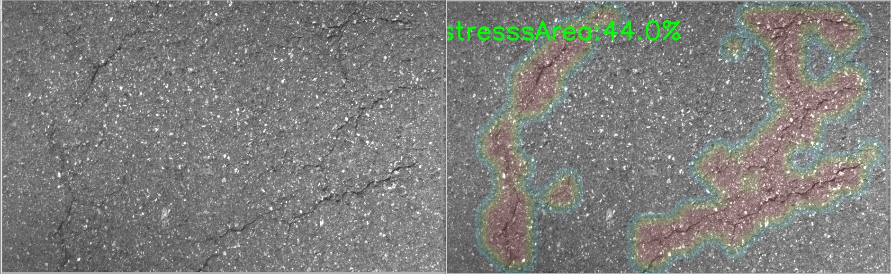

# Introduction
road_crack_detect ：利用深度学习技术，检测高速公路路面病害（裂缝、坑洞等）。

# How to Run
## 环境准备
- 需要安装python 3.5
- 以下python包需要安装：
  - tensorflow
  - keras
  - numpy
  - opencv
  - heatmap

## 运行程序
1. 运行predict_highway.py
  ```bash
  python predict_highway.py
  ```
运行结束后，标注后的图片会保存在./images_dst目录。
识别效果如下图所示：
左边为原图，右边为标注后的图片，可以看到道路中的裂缝被正确识别出来，并使用热力图进行了标注。



## 其他说明
1. 模型训练脚本未包含在仓库中。
2. 数据集未包含在仓库中。
